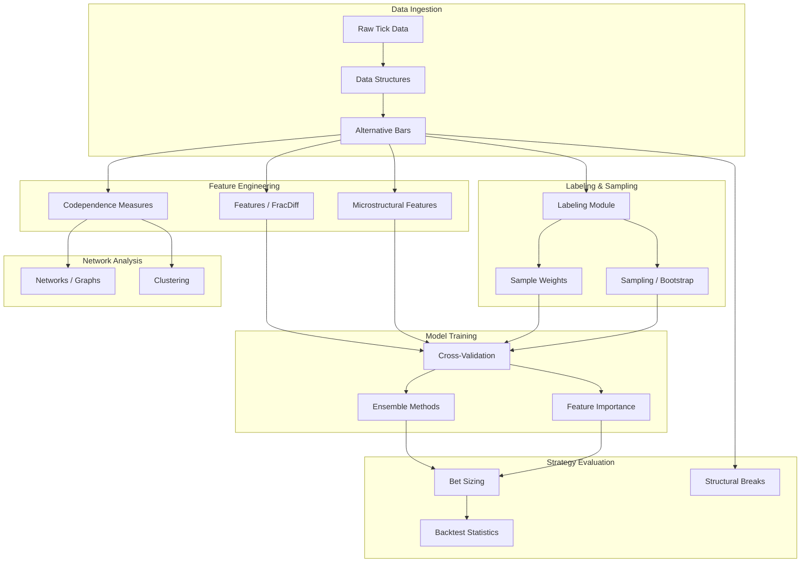
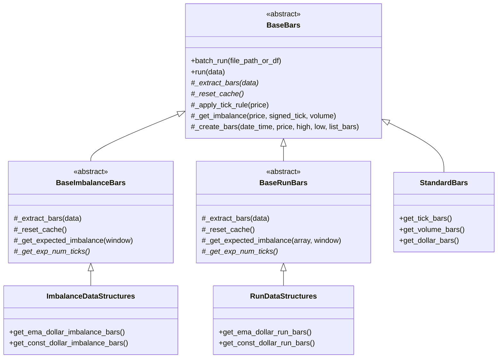
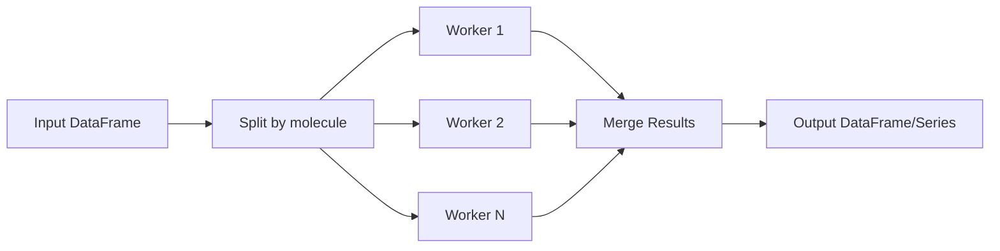
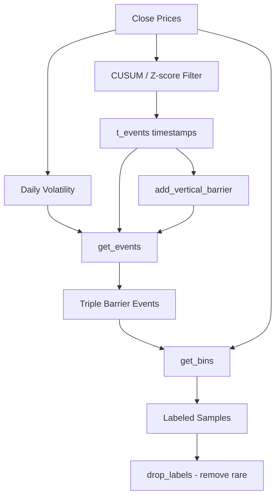
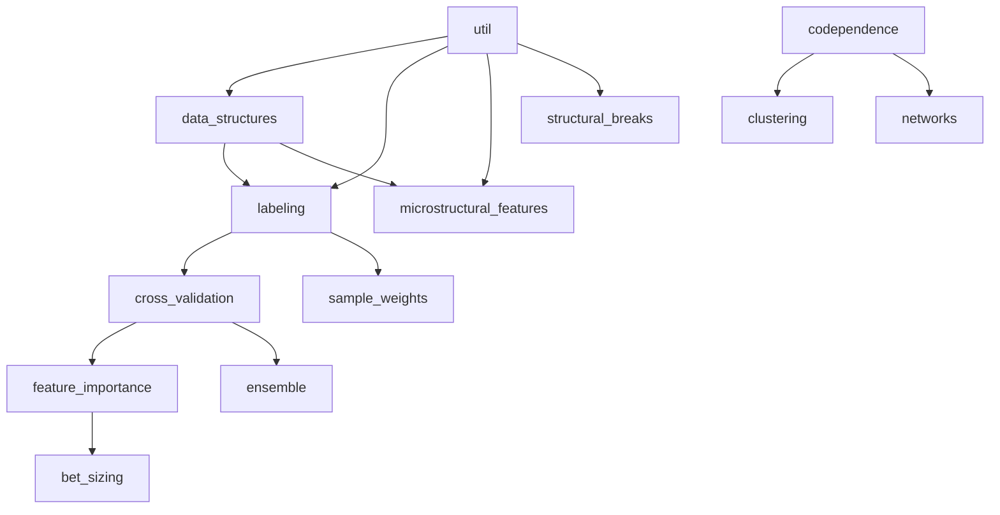

# MLFinLab Architecture

## System Architecture Overview

MLFinLab follows a modular, pipeline-oriented architecture where each module addresses a specific stage of the financial machine learning workflow. Modules are designed to be used independently or composed into complete pipelines.



## Trading Paradigm & Key Features

| Feature | Support | Details |
|---------|---------|---------|
| Backtesting Approach | None | Research library only; provides backtest statistics but no backtesting engine |
| Live Trading | No | No execution or order management capabilities |
| Paper Trading | No | Not applicable -- research/analysis library |
| Multi-Asset | Yes | Asset-agnostic; operates on pandas DataFrames of any asset class |
| Data Feeds | None | Accepts pandas DataFrames/Series and CSV files as input |
| ML Integration | Yes | Core purpose -- implements ML pipeline from AFML book (labeling, CV, feature importance, ensemble methods) |
| Risk Management | Custom | Bet sizing module converts ML predictions to position sizes |
| Optimization | No | No built-in optimization; designed to feed into external ML model training |
| Execution | None | No execution capabilities; outputs labels, features, and position sizes for external use |

## Core Design Patterns

### Abstract Base Class Hierarchy (Data Structures)

The bar generation system uses a layered class hierarchy:



### Multiprocessing Architecture

MLFinLab uses a parallelization utility (`mp_pandas_obj`) throughout the library for computationally intensive operations:



Key uses:
- Triple Barrier labeling (parallelized across event timestamps)
- SADF computation (parallelized across time indices)
- Cross-validation scoring (parallelized across folds)
- Sample weight calculation (parallelized across observations)

### Labeling Pipeline

The labeling system follows a sequential pipeline pattern:



### Cross-Validation with Purging and Embargo

```mermaid
flowchart LR
    subgraph "Standard K-Fold"
        S1[Split 1] --> S2[Split 2] --> S3[Split 3] --> S4[Split 4]
    end

    subgraph "Purged K-Fold"
        PS1[Split 1] --> PURGE[Purge Overlapping] --> EMB[Apply Embargo]
        EMB --> PS2[Clean Train Set]
    end

    subgraph "Combinatorial PCV"
        COMB[All C(N,K) combinations] --> PATHS[Backtest Paths]
        PATHS --> EVAL[Path-wise Evaluation]
    end
```

## Module Dependencies



## Key Architectural Decisions

1. **Stateless functions over classes**: Most modules expose top-level functions rather than requiring class instantiation, following the pattern in the AFML book.

2. **Pandas-native interfaces**: All inputs and outputs use pandas Series/DataFrame, ensuring interoperability with the Python data science ecosystem.

3. **Batch processing for large datasets**: The `BaseBars` class processes tick data in configurable batch sizes (default 20M rows) to handle datasets that do not fit in memory.

4. **Abstract methods for extensibility**: The bar system uses abstract methods (`_extract_bars`, `_reset_cache`) to allow new bar types to be added by implementing a few methods.

5. **EWMA-based adaptive thresholds**: Information-driven bars (imbalance and run bars) use exponentially weighted moving averages to adaptively set bar formation thresholds.

6. **Separation of concerns in labeling**: The labeling pipeline separates event detection (filters), barrier construction (get_events), and label assignment (get_bins) into distinct, composable steps.

---
## See Also
- [README](README.md) — Project overview and quick start
- [Workflow](workflow.md) — Event flows and processing pipelines
- [State Management](state-management.md) — State lifecycle and data models
- [Development](development.md) — Development guide and best practices
