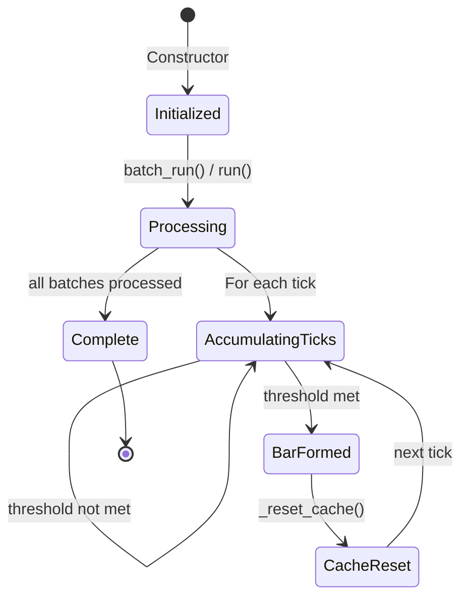
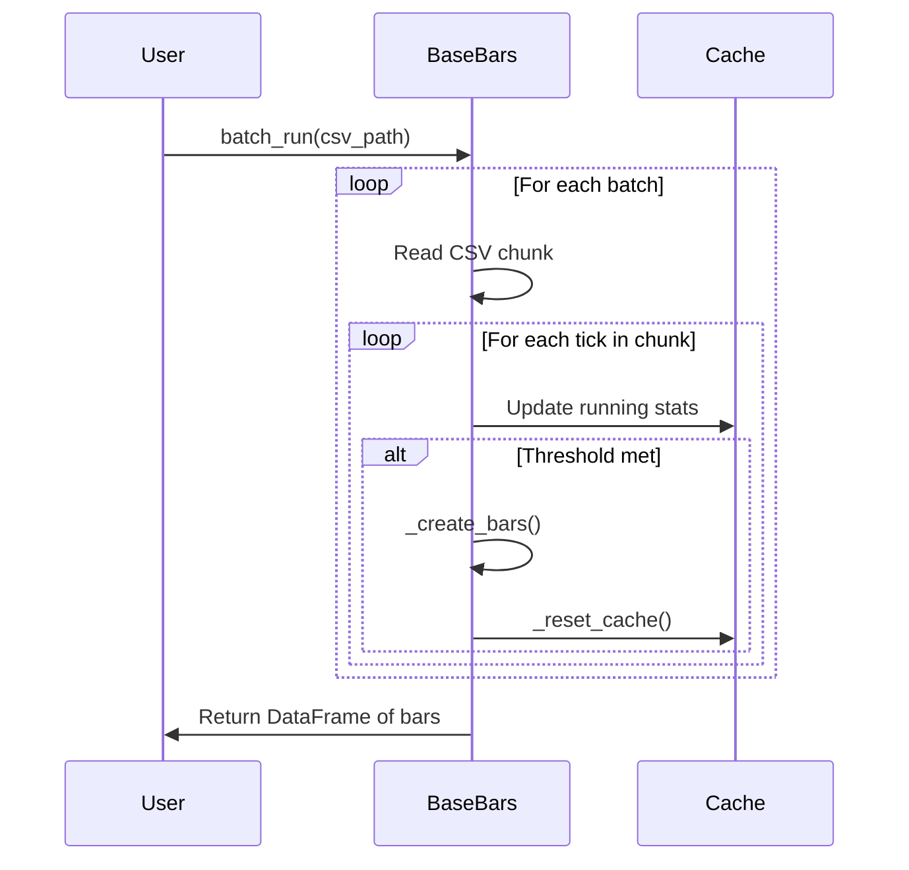
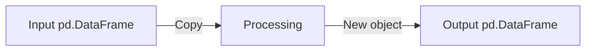

# MLFinLab State Management

## Overview

MLFinLab operates primarily as a stateless library with functional interfaces. Most modules expose pure functions that take data in and return results without maintaining persistent state. The exceptions are the bar generation classes and the microstructural features generator, which maintain internal caches during streaming-style batch processing.

## Stateful Components

### BaseBars Cache System

The `BaseBars` class and its descendants maintain running state during bar construction from tick data:



**Cache attributes maintained per bar (BaseBars)**:
- `open_price` - Opening price for current bar
- `high_price` - Running high for current bar
- `low_price` - Running low for current bar
- `cum_statistics` - Cumulative volume, ticks, dollar value
- `prev_tick_rule` - Previous tick direction for tick rule
- `cache` - List of accumulated ticks

**Additional cache for ImbalanceBars**:
- `imbalance_array` - Running array of signed imbalances
- `expected_imbalance` - EMA of expected imbalance threshold
- `exp_num_ticks` - Expected number of ticks per bar (adaptive)
- `cum_theta` - Cumulative imbalance (theta)

**Additional cache for RunBars**:
- `expected_buy_imbalance` - Expected proportion of buy ticks
- `expected_sell_imbalance` - Expected proportion of sell ticks
- `buy_ticks_num` - Count of buy ticks in current bar
- `exp_buy_ticks_proportion` - Expected buy tick proportion

### MicrostructuralFeaturesGenerator State

Maintains running state between tick batches:

- `prev_price` - For tick rule and price diff computation
- `prev_tick_rule` - Previous tick classification
- `tick_rule_array` - Accumulated tick rules for current bar
- `price_diff_array` - Price differences in current bar
- `trade_size_array` - Trade sizes in current bar
- `log_ret_array` - Log returns within current bar

### Lifecycle of Cache State



## Stateless Components

The majority of MLFinLab is stateless by design:

| Module | State Model | Notes |
|--------|-------------|-------|
| `labeling` | Stateless | Pure functions on Series/DataFrames |
| `features` | Stateless | `FractionalDifferentiation` methods are all `@staticmethod` |
| `cross_validation` | Stateless | `split()` generates indices on the fly |
| `feature_importance` | Stateless | Takes fitted model + data, returns importance scores |
| `structural_breaks` | Stateless | Pure statistical tests on time series |
| `bet_sizing` | Stateless | Maps predictions to position sizes |
| `codependence` | Stateless | Computes pairwise measures |
| `clustering` | Stateless | Returns clusters from correlation matrix |
| `networks` | Minimal state | `Graph` objects hold a NetworkX graph + metadata |
| `backtest_statistics` | Stateless | Computes metrics from return series |
| `filters` | Stateless | Detects events from price series |
| `sampling` | Stateless | Generates bootstrap indices |
| `sample_weights` | Stateless | Computes weights from event data |
| `data_generation` | Stateless | Generates synthetic data from parameters |

## Data Flow and Immutability

MLFinLab does not mutate input data. Functions return new DataFrames/Series. The typical data flow is:



Key immutability practices:
- Input DataFrames are never modified in place
- Functions return new pandas objects
- The `batch_run` method constructs bars incrementally via list appending, then converts to DataFrame at the end

## Configuration and Parameters

MLFinLab uses no global configuration state. All parameters are passed explicitly:

- **Batch size**: Passed to bar constructors (default 2e7)
- **Thread count**: Passed to `num_threads` parameter on parallelized functions
- **Thresholds**: Passed per-call (e.g., CUSUM threshold, bar formation threshold)
- **Model parameters**: Passed as function arguments (e.g., `model='linear'` for SADF)

This design makes the library thread-safe and easy to reason about -- there are no hidden dependencies between calls.

## Serialization

MLFinLab does not implement custom serialization. Since outputs are standard pandas objects, standard serialization approaches work:

```python
# Save bars to CSV/Parquet
bars.to_csv('bars.csv')
bars.to_parquet('bars.parquet')

# Save labels
labels.to_pickle('labels.pkl')
```

The `BaseBars` class supports streaming output via `to_csv=True` parameter in `batch_run()`, writing bars directly to disk as they are formed rather than accumulating them in memory.

---
## See Also
- [README](README.md) — Project overview and quick start
- [Architecture](architecture.md) — System design and components
- [Workflow](workflow.md) — Event flows and processing pipelines
- [Development](development.md) — Development guide and best practices
