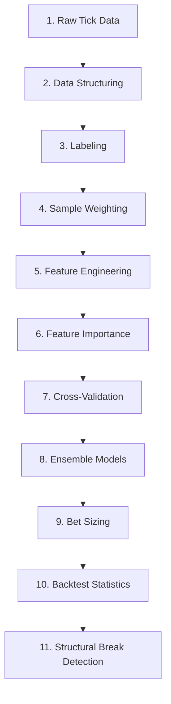
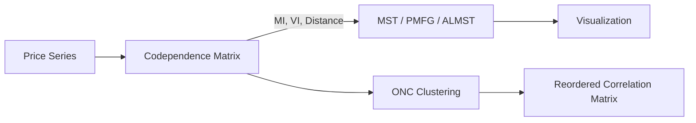

# MLFinLab Workflow

## End-to-End Financial ML Pipeline

The canonical workflow follows the progression laid out in "Advances in Financial Machine Learning":



## Step-by-Step Workflow

### 1. Data Structuring (Bars)

Convert raw tick data into meaningful bars:

```python
from mlfinlab.data_structures import standard_data_structures as sds

# Standard bars
tick_bars = sds.get_tick_bars('ticks.csv', threshold=1000)
volume_bars = sds.get_volume_bars('ticks.csv', threshold=50000)
dollar_bars = sds.get_dollar_bars('ticks.csv', threshold=1e6)

# Information-driven bars
from mlfinlab.data_structures import imbalance_data_structures as ids
imb_bars = ids.get_ema_dollar_imbalance_bars(
    'ticks.csv',
    exp_num_ticks_init=10000,
    expected_imbalance_window=10000
)
```

**Output**: DataFrame with columns `[date_time, open, high, low, close, volume, cum_buy_volume, cum_ticks, cum_dollar_value]`

### 2. Labeling

Apply the Triple Barrier Method and meta-labeling:

```python
import mlfinlab.labeling as labeling
from mlfinlab.filters.filters import cusum_filter

# Event detection via CUSUM filter
cusum_events = cusum_filter(bars['close'], threshold=daily_vol.mean())

# Vertical barrier
t1 = labeling.add_vertical_barrier(cusum_events, bars['close'], num_days=5)

# Triple Barrier events
events = labeling.get_events(
    close=bars['close'],
    t_events=cusum_events,
    pt_sl=[1, 2],           # profit-take at 1x vol, stop-loss at 2x vol
    target=daily_vol,
    min_ret=0.005,
    num_threads=8,
    vertical_barrier_times=t1
)

# Generate labels
labels = labeling.get_bins(events, bars['close'])
labels = labeling.drop_labels(labels, min_pct=0.05)
```

**Alternative labeling methods**:
- `labeling.trend_scanning` - Trend scanning labels
- `labeling.fixed_time_horizon` - Fixed horizon returns
- `labeling.excess_over_mean` / `excess_over_median` - Relative return labels
- `labeling.raw_return` - Simple return-based labels
- `labeling.matrix_flags` - Flag-based pattern labels

### 3. Sample Weights & Sampling

Address non-IID properties of financial data:

```python
from mlfinlab.sample_weights import attribution
from mlfinlab.sampling import bootstrapping, concurrent

# Compute sample uniqueness / concurrency
num_concurrent = concurrent.get_num_co_events(
    bars['close'].index, events['t1'], molecule=events.index
)

# Attribution-based weights
weights = attribution.get_weights_by_time_decay(
    events['t1'], num_co_events=num_concurrent, decay=1
)

# Sequential bootstrapping
from mlfinlab.sampling.bootstrapping import get_ind_matrix, seq_bootstrap
ind_matrix = get_ind_matrix(events['t1'], bars['close'])
bootstrap_indices = seq_bootstrap(ind_matrix, sample_length=500)
```

### 4. Feature Engineering

```python
from mlfinlab.features.fracdiff import FractionalDifferentiation

# Fractional differentiation - stationarity with memory
frac = FractionalDifferentiation()
frac_close = frac.frac_diff_ffd(bars[['close']], diff_amt=0.4, thresh=1e-5)

# Find minimum d for stationarity
from mlfinlab.features.fracdiff import plot_min_ffd
plot_min_ffd(bars[['close']])

# Microstructural features
from mlfinlab.microstructural_features.feature_generator import MicrostructuralFeaturesGenerator
gen = MicrostructuralFeaturesGenerator(
    trades_input='ticks.csv',
    tick_num_series=tick_nums,
    volume_encoding={'buy': 1, 'sell': -1}
)
micro_features = gen.get_features()
```

### 5. Feature Importance

Evaluate which features matter:

```python
from mlfinlab.feature_importance.importance import (
    mean_decrease_impurity,
    mean_decrease_accuracy,
    single_feature_importance,
    plot_feature_importance
)

# MDI - fast, in-sample
mdi = mean_decrease_impurity(rf_model, feature_names)

# MDA - slower, out-of-sample
mda = mean_decrease_accuracy(
    rf_model, X_train, y_train,
    cv_gen=purged_cv,
    scoring=log_loss
)

# SFI - no substitution effects
sfi = single_feature_importance(
    rf_model, X_train, y_train,
    cv_gen=purged_cv
)
```

### 6. Cross-Validation

Prevent information leakage with purged CV:

```python
from mlfinlab.cross_validation.combinatorial import CombinatorialPurgedKFold

cpcv = CombinatorialPurgedKFold(
    n_splits=6,
    n_test_splits=2,
    samples_info_sets=info_sets,
    pct_embargo=0.01
)

for train_idx, test_idx in cpcv.split(X):
    # Train and evaluate model
    pass
```

### 7. Bet Sizing

Convert model predictions to position sizes:

```python
from mlfinlab.bet_sizing.bet_sizing import (
    bet_size_probability,
    bet_size_dynamic
)

# Probability-based sizing
positions = bet_size_probability(
    events=events,
    prob=model.predict_proba(X_test),
    num_classes=3,
    step_size=0.05,
    average_active=True
)

# Dynamic sizing with sigmoid response
positions = bet_size_dynamic(
    current_pos=0,
    max_pos=100,
    market_price=100.5,
    forecast_price=102.0
)
```

### 8. Strategy Evaluation

```python
from mlfinlab.backtest_statistics import statistics, backtests

# Deflated Sharpe Ratio
dsr = statistics.estimated_sharpe_ratio(returns)

# Probabilistic Sharpe Ratio
psr = statistics.probabilistic_sharpe_ratio(
    observed_sr=1.5,
    benchmark_sr=0,
    number_of_returns=252
)
```

## Codependence & Network Analysis Workflow



```python
from mlfinlab.codependence.information import get_mutual_info
from mlfinlab.networks.mst import MST
from mlfinlab.clustering.onc import get_onc_clusters

# Codependence
mi = get_mutual_info(x, y, normalize=True)

# Network construction
mst = MST(distance_matrix, matrix_type='distance')
graph = mst.get_graph()

# Clustering
corr_matrix, clusters, silh = get_onc_clusters(corr_matrix)
```

## Structural Break Detection Workflow

```python
from mlfinlab.structural_breaks.sadf import get_sadf
from mlfinlab.structural_breaks.chow import get_chow_type_stat
from mlfinlab.structural_breaks.cusum import get_chu_stinchcombe_white_statistics

# SADF test for bubbles
sadf = get_sadf(
    series=log_prices,
    model='linear',
    lags=1,
    min_length=20
)

# Chow structural break test
chow_stat = get_chow_type_stat(series, min_length=20)

# CUSUM test
cusum = get_chu_stinchcombe_white_statistics(series)
```

---
## See Also
- [README](README.md) — Project overview and quick start
- [Architecture](architecture.md) — System design and components
- [State Management](state-management.md) — State lifecycle and data models
- [Development](development.md) — Development guide and best practices
